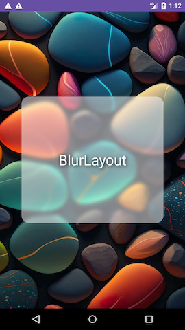
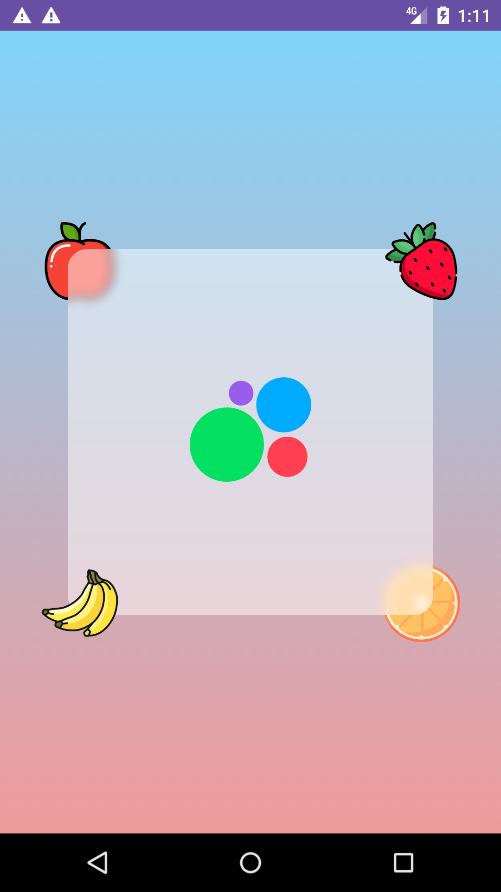

# BlurLayout

FrameLayout extension to support blurred semitransparent backgrounds in Android.




## Motivation

There's no default support in Android for blurring views' semitransparent backgrounds
taking into account all the layers behind the blurred background
(which is frequently used in such design patterns as
[glassmorphism](https://www.google.com/search?q=glassmorphism)).

BlurLayout is what solves this issue.

## Get started

### Add Dependency

```kotlin
implementation("com.avito.android:blur-layout:1.0.1")
```

### Initialize library

Initialize layout in `Application.onCreate()` providing a transformer function to apply blur effect
on a bitmap that will be passed to the transformer from the BlurLayout.
External blur applier is used as there are several existing methods to apply blur effect
to a bitmap – so you can choose the one that better fits your needs.
The one that is used in this demo and in Avito itself is Google's official library
[renderscript-toolkit](https://github.com/android/renderscript-intrinsics-replacement-toolkit).

```kotlin
BlurLayout.init(
    onApplyBlur = { bitmap, blurRadius ->
        Toolkit.blur(inputBitmap = bitmap, radius = blurRadius)
    },
)
```

### Use via XML

1. Wrap all the elements that should be taken into account while blurring view's semitransparent
   background with `<com.avito.android.blur_layout.BlurLayout />`.
2. Specify `BlurLayout` parameters.

   ```
   <!--id of the blurred background target.
   Might be omitted when there's single child.-->
   app:blurLayout_targetChildId="..."
   
   <!--Might be omitted if target view implements BlurLayout.BlurRadiusProvider.-->
   app:blurLayout_blurRadius="..."
   
   <!--Optional parameter to apply rounded corners to the blurred background.
   Might be omitted if target view implements `BlurLayout.CornerRadiusProvider`-->
   app:blurLayout_targetChildBackgroundCornerRadius="..."
   ```

3. Specify target view's background. E.g. `android:background="#80FFFFFF"`.

#### Single child example

```xml

<com.avito.android.blur_layout.BlurLayout
    android:background="@drawable/background_rocks"
    app:blurLayout_blurRadius="25"
    app:blurLayout_targetChildBackgroundCornerRadius="16dp">

    <View android:background="#80FFFFFF" />

</com.avito.android.blur_layout.BlurLayout>
```

For the full example refer to
[layout_example_rocks.xml](app/src/main/res/layout/layout_example_rocks.xml)

#### Multiple children example

```xml
<com.avito.android.blur_layout.BlurLayout
    android:background="@drawable/background_gradient"
    app:blurLayout_blurRadius="25"
    app:blurLayout_targetChildBackgroundCornerRadius="16dp"
    app:blurLayout_targetChildId="@id/blurred_background_view">

    <ImageView android:src="@drawable/ic_apple" />

    <ImageView
        android:id="@+id/blurred_background_view"
        android:background="#80FFFFFF"
        app:srcCompat="@drawable/ic_avito_logo" />

    <ImageView android:src="@drawable/ic_strawberry" />

</com.avito.android.blur_layout.BlurLayout>
```

For the full example refer to
[layout_example_fruits.xml](app/src/main/res/layout/layout_example_fruits.xml)

### Use via code

```kotlin
BlurLayout(context = this).apply {
    // add children
}.setBlurredBackgroundForTargetChild(
    targetChild = TODO("Might be omitted if single child"),
    blurRadius = TODO(
        "Might be omitted if target view implements BlurLayout.BlurRadiusProvider"
    ),
    targetChildBackgroundCornerRadius = TODO(
        "Might be omitted if target view implements BlurLayout.CornerRadiusProvider"
    )
)
```
